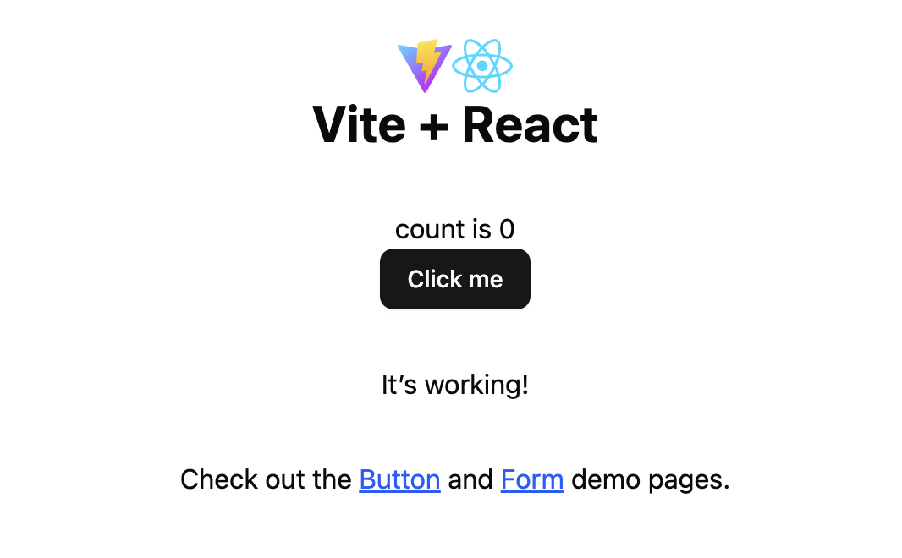

# React Prototyping Boilerplate

The purpose of this project is to provide a simple site framework for designers who want an easy way to drop in React pages and components generated by LLMs like Claude for viewing and tweaking locally.

It uses [Vite](https://vite.dev/) build tools, [shadcn](https://ui.shadcn.com/) components, and [Tailwind CSS](https://tailwindcss.com/) styling, which is generally compatible with the typescript (.tsx) files you get out of LLMs.

Some benefits of this approach:

- View files directly in the browser instead of throught he LLM UI.

- Make tweaks quickly and directly without asking the LLM for everything.

- Link pages together for flexible prototyping.

## Installation

### Installing Node.js

This requires Node.js to be installed on your machine. You can check if it's installed by opening terminal and running this command to see the version: `node -v`.

If you get a "command not found" message, go to the [Node.js download page](https://nodejs.org/en/download) to get it. You can use the selection tool to run the installation from the command line or the download the binary and run it from your machine.

Pick the current LTS (long-term support) version of Node.

The command line tool will have you pick a node version manager and node package manager. Unless you have a preference for something else, use `nvm` and `npm`.

### Installing the project

If you want to manage your own project on Github, you can copy this repo as a template. Alternatively, you can download a .zip file using the Code button and just keep it locally on your machine, without version control.

> [!TIP]
> I recommend using [VS Code](https://code.visualstudio.com/Download) since it combines your text editor and your terminal in one app.

Either way, once you have a copy of the project on your machine (and unzipped), go to the project folder in your terminal app.

Use the "change directory" command to navigate to the folder. It should look something like this: `cd ~/Documents/vite-boilerplate`. You can check where you are with the "print working directory" command, `pwd`.

Once you're in the project directory, run this command: `npm install --legacy-peer-deps`. This will install all the necessary files locally to run the project. The [legacy-peer-dependency flag](https://ui.shadcn.com/docs/react-19#solution-1---force-or---legacy-peer-deps) ignores dependency conflicts, which shouldn't cause problems.

## Running the project

If everything went OK with installation, now you can run this command to start the project: `npm run dev`. This runs the project in development mode. If it works, you'll see a message that it's now running on a local server, for example, `Local: http://localhost:5173/`. You can click on that link (maybe with a modifier key) to see the site running in your browser, or just copy and paste.

If it's running you should see this in your browser at the localhost URL:

To stop the server, the command is usually `control-C`.

Whenever you want to run the project again, you'll just use the command `npm run dev` again. You don't have to reinstall. Periodically, you may want to run `npm update --legacy-peer-deps` to update the package dependencies.

## Adding pages

1. Generate a page with an LLM like Claude. (Ask it to use shadcn components.)
1. Once it displays correctly in the LLM UI, download the file, which will probably be a typescript file (.tsx).
1. Move the file, e.g., signup-form.tsx to the `/src/pages` directory in your project.

If the development server is running, the browser should refresh automatically when adding pages or making changes. If you've just added a new page, you'll need to go to the URL to see it (page name without suffix, e.g., `localhost:5173/signup-form`).

> [!TIP]
> The import statement lets your main app know the page exists and the router points the browser to that file based on the URL defined.

## Styling components

Use the standard Tailwind syntax to style components. With React, you apply these using the `className` attribute. See some of the demo page examples.

## Tips

- Don't worry about typescript warnings, or even errors, if the page is loading. If there's a big problem, the page won't even load.
- If pages aren't showing up or the server isn't starting because something is missing, double check that your import statements and router settings are correct.
